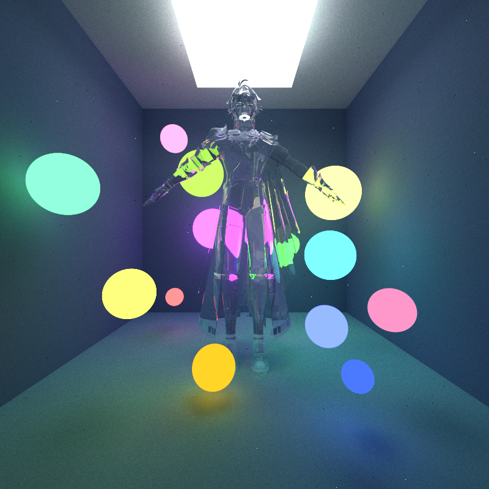
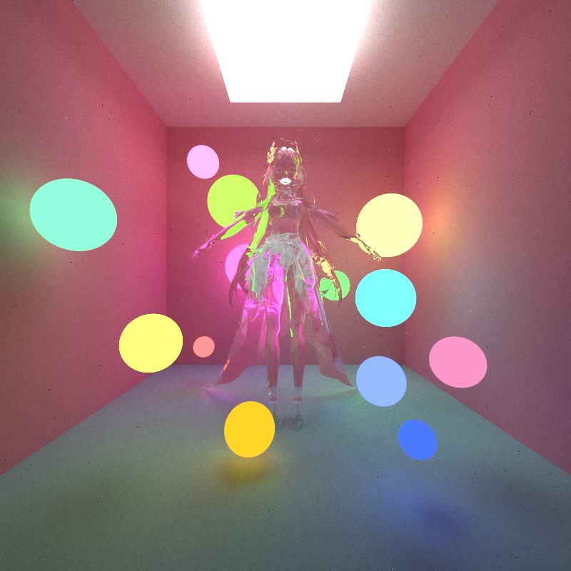
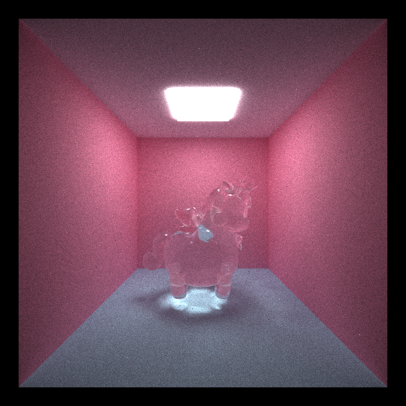
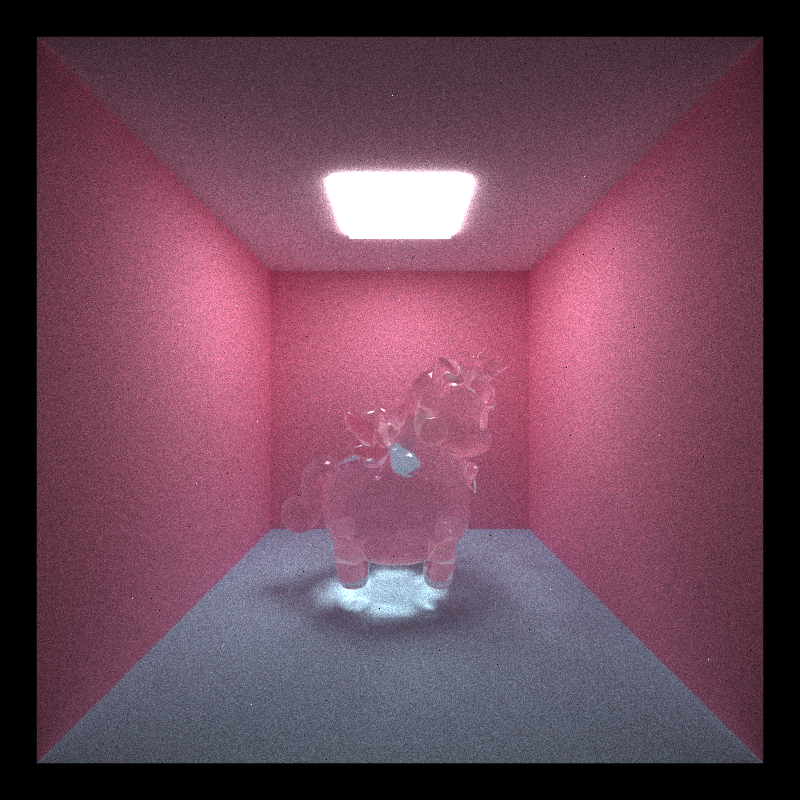

CUDA Path Tracer

|  |  |
|:--:|:--:|
| Phainon, Honkai Star Rail | Cyrene, Honkai Star Rail |
| Material: glass | Material: glass |

================

**University of Pennsylvania, CIS 565: GPU Programming and Architecture, Project 3**

* Jacqueline (Jackie) Li
  * [LinkedIn](https://www.linkedin.com/in/jackie-lii/), [personal website](https://sites.google.com/seas.upenn.edu/jacquelineli/home), [Instagram](https://www.instagram.com/sagescherrytree/), etc.
* Tested on: Windows 10, 11th Gen Intel(R) Core(TM) i7-11800H @ 2.30GHz, NVIDIA GeForce RTX 3060 Laptop GPU (6 GB)

# Features Implemented

1. Basic Pathtracer w/ diffuse shading.
2. Stream Compaction on terminated rays.
3. Material sorting.
4. Stochastic sampled antialiasing. 
5. Reflective and refractive materials (specular). (2)
6. Depth of field. (2)
7. Mesh loading, OBJ. (2)
8. BVH acceleration. (6)
9. Textures. (3)
10. Bump maps. (3)
10. Microfacet Materials. (works! ???? points)

# Basic Diffuse Pathtracer

# Additional Features

## Stream Compaction Optimization for Base Pathtracer

Used thrust/partition to read in number of currently active paths (light rays) to device, then partition them based on whether or not path is currently active. Partition will sort the rays into currently active in the front, and terminated rays after, and it returns the end pointer to the reduced dev_path array containing currently active rays. 

Stream compaction reduces iteration time from ~880 ms/frame to ~500 ms/frame.

[ Insert performance analysis here ].

## Material Sorting

To be honest, I did not see a significant impact in performance once material sorting was implemented, plausibly due to the fact that there are not enough materials to render to be able to notice the impact. 

[ Insert performance "analysis" here ].

## Stochastic Sampled Antialiasing

## Mesh Loading

Libraries used: tiny_obj.h.

Using tiny_obj.h, I was able to implement basic .obj mesh loading for any (relatively) low-poly model.

## BVH Acceleration

##### References

* [Jacco How to Build a BVH] (https://jacco.ompf2.com/2022/04/13/how-to-build-a-bvh-part-1-basics/)
* [Sebastian Lague Coding Adventure: More Raytracing!] (https://www.youtube.com/watch?v=C1H4zIiCOaI)

|  |  |
|:--:|:--:|
|Running phat_phuck.obj with no basic BVH |Running phat_phuck.obj with basic BVH |
| application average: 732.856 ms/frame, 1.4 fps | application average: 99.365 ms/frame, 10.0 fps |

For more complicated models, the frame rate will decrease.

|  |
E.g. running cyrene.obj, application average is 282.242 ms/frame, 3.6 FPS.

[ Insert performance analysis here ].

## Textures

Libraries used: stb_image.h.

## Bump Maps

## Depth of Field

## Refraction Materials (Implement Extension from Pure Specular)

## Microfacet Materials
I followed PBRT and my old implementation of my GLSL pathtracer from my Advanced Rendering course to implement Cook Torrance Microfacets. Along the way, I encountered a curious hemisphere bug, which split my sphere into what appears to be four hemispheres. 


# Bugs During Implementation

#### Diffuse Sampling Implementation

Missing a sampling dimension from sphere to hemisphere cosine sampling caused an artifact that did not allow throughput to accumulate properly on the vertical. 

#### Reflection and Transmissive Material Implementation

Bugs in this domain come primarily from frame of reference errors pertaining to my pathSegment.ray.direction.

##### Reflection Bug

Normals mapped to worldspace not being used in reflecting ray properly.

##### A Curious Transmission Bug

Upon normalizing my normal input from the ray as well as pathSegment.ray.direction, I get rings around the sphere, that simultaneously look cool and creepy. 

Here is the code to replicate the bug:
```
// Specular Transmission.
__device__ glm::vec3 sampleFSpecularTrans(
    const glm::vec3& albedo,
    const glm::vec3& normal,
    const glm::vec3& wo,
    const float& IOR,
    glm::vec3& wiW) {

    // Index of refraction of glass.
    float etaA = 1.f;
    float etaB = IOR;

    glm::vec3 N = glm::normalize(normal);
    glm::vec3 woNormal = glm::normalize(wo); // The ray's direction as read from pathSegment in ScatterRay.

    // Test z coordinate of wo (if z coord > 0, then about to enter transmissive surface.)
    bool entering = wo.z > 0.f;
    float etaI = entering ? etaA : etaB;
    float etaT = entering ? etaB : etaA;

    float eta = etaI / etaT;

    wiW = glm::normalize(glm::refract(-woNormal, N, eta));

    if (glm::length(wiW) < EPSILON) {
        return glm::vec3(0.0f);
    }

    return albedo;
}
```

##### Trasmission Epsilon Bug

Beware of EPSILON values that are too small... When I changed the EPSILON value to 0.0001f from 0.000001f, the glass material started to work. I presume it is b/c the ray is stepping in too small and getting stuck in the reflective material, resulting in the strange albedo throughput b/c the rest of the rays in the scene are never influencing it.

Also, an interesting matter to point out is that within the sampling function, the smaller EPSILON value blurs out the light caustic more than comparing w/ the larger EPSILON.

##### Microfacet Materials

I followed PBRT and my old implementation of my GLSL pathtracer from my Advanced Rendering course to implement Cook Torrance Microfacets. Along the way, I encountered a curious hemisphere bug, which split my sphere into what appears to be four hemispheres. 

This bug was however solved by simply checking the hemisphere sampling conventions. 

# GPU Path Tracer

### Core Features Completed
- [x] Shading kernel with BSDF evaluation (diffuse, specular).
- [x] Stream-compacted path termination using thrust library.
- [x] Sorting by material type.
- [x] Stochastic sampled antialiasing.

---

### Extended Features Completed

#### Visual Improvements
- [x] BRDF refraction.
- [x] Physically based depth of field.
- [x] Microfacet materials (Cook Torrance model).
- [x] Texture loading and bump maps.

#### Mesh Improvements
- [x] Mesh loading (obj).

#### Performance Improvements
- [x] BVH acceleration.

---

### Other Features and Details
- **Libraries added:**  
  - `stb_image.h`  
  - `stb_image_write.h`
  - `json.hpp`  
  - `tiny_obj.h`
- **Scene file changes:**  
  - `cornell.json`
  - `cornell_glass_test.json`
  - `cornell_microfacet_test.json`
  - `cornell_multiple_glass.json`
  - `cornell_obj_anaxagoras_glass.json`
  - `cornell_obj_bnnuy.json`
  - `cornell_obj_castorice_glass.json`
  - `cornell_obj_phainon_glass.json`
  - `cornell_obj_phatphuck.json`
  - `cornell_obj_phatphuck_alt.json`
  - `cornell_obj_phatphuck_microfacet.json`
  - `cornell_obj_phatphuck_texture_test.json `
  - `cornell_obj_specular.json `
  - `cornell_obj_test.json `
  - `cornell_reflective_test.json`
  - `cornell_transmissive_test.json`

---

## 🧩 README Completion Checklist
- [ ] Cover image in README (not using Cornell Box)
- [ ] Descriptions, screenshots, debug images, side-by-side comparisons of features implemented
- [ ] Analysis section
- [ ] Scenes and meshes included or linked
- [ ] Third-party library changes or compilation instructions documented
- [ ] Bloopers (optional)

---

## 🕒 Late Days Used
- 2 late days

---

## 🗒️ Project Feedback
I wish this project could last longer. I want to implement more features.