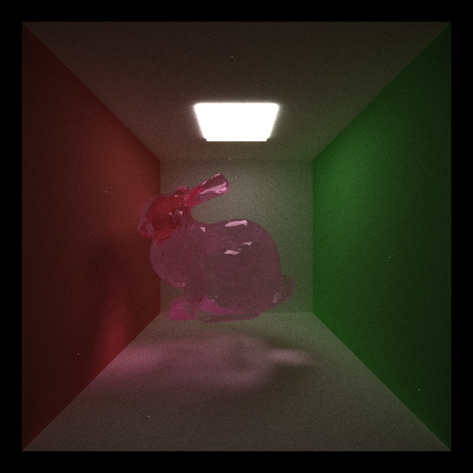

CUDA Path Tracer

|  |
|:--:|
| Cyrene, Honkai Star Rail |
| Material: ceramic |

================

**University of Pennsylvania, CIS 565: GPU Programming and Architecture, Project 3**

* Jacqueline (Jackie) Li
  * [LinkedIn](https://www.linkedin.com/in/jackie-lii/), [personal website](https://sites.google.com/seas.upenn.edu/jacquelineli/home), [Instagram](https://www.instagram.com/sagescherrytree/), etc.
* Tested on: Windows 10, 11th Gen Intel(R) Core(TM) i7-11800H @ 2.30GHz, NVIDIA GeForce RTX 3060 Laptop GPU (6 GB)

# Features Implemented

1. Basic Pathtracer w/ diffuse shading.
2. Stream Compaction on terminated rays.
3. Material sorting.
4. Stochastic sampled antialiasing. 
5. Reflective and refractive materials (specular). (2)
6. Depth of field. (2)
7. Mesh loading, OBJ. (2)
8. BVH acceleration. (6)
9. Textures. (3)
10. Bump maps. (3)
10. Microfacet Materials. (works! ???? points)

# Basic Diffuse Pathtracer

The basic structure of a GPU pathtracer is to call kernels to generate rays, compute intersections, then compute the shading methods from the computed intersections. All of these are wrapped up in a larger pathtracing kernel, which will iterate through the intersection kernel and the shader kernel maximum depth number of times. The baseline for the diffuse pathtracer was simply to implement the shading kernel and integrate it within the pathtracer, which included setting up the ShadeableIntersection struct and the Material struct, then to pass that and the current pathSegments array (generated from the GenerateRay kernel) into a ScatterRay kernel, which runs on global memory, and selects the type of sampling to call based on the material type, which is passed in as well via the MaterialComputation kernel. 

For the basic pathtracer, I simply implemented a basic diffuse BSDF, using cosine sampling and returning a BSDF value of albedo / PI. Cosine sampling is a more efficient usage of sampling rays, as it will sample more naturally towards the distribution of the normal (cos(theta) = 0), whilst sampling less at edges (cos(theta) = 90), as those places are not touched by light as much. 

|  |
|:--:|

This is the basic diffuse output from my pathtracer. 

## Stream Compaction Optimization for Base Pathtracer

Libraries used: thrust.h
Sublibraries used: 
- `#include <thrust/execution_policy.h>`
- `#include <thrust/random.h>`
- `#include <thrust/remove.h>`
- `#include <thrust/device_vector.h>`
- `#include <thrust/partition.h>`

Used thrust/partition to read in number of currently active paths (light rays) to device, then partition them based on whether or not path is currently active. Partition will sort the rays into currently active in the front, and terminated rays after, and it returns the end pointer to the reduced dev_path array containing currently active rays. 

For sorting the rays, I used the thrust/stable_partition method, which sorts an array into items that pass a certain criterion in the front, and items that fail the criterion in the back. It will return a pointer to the end of the front, correct part of the partition, which I then use to compact the pathSegments passed in. 

Stream compaction reduces iteration time from ~880 ms/frame to ~500 ms/frame.

|  |  |
|:--:|:--:|
| Diffuse sphere, no stream compaction | Diffuse sphere, stream compaction |
| application average: 101.262 ms/frame, 11.0 FPS | application average: 42.204 ms/frame, 24.0 FPS |

Stream compaction comparison in closed scene v. open scene.

|  |  |
|:--:|:--:|
| phat_phuck.obj, closed scene stream compaction | phat_phuck.obj, open scene stream compaction |
| application average: 148.669 ms/frame, 6.6 FPS | application average: 109.650 ms/frame, 9.0 FPS|

This shows that there appears to be a decrease in speed for when the scene is closed in terms of the terminating rays, which is most likely due to the fact that we set the terminating sort condition to remainingBounces = 0, which in an enclosed space the ray is less likely to terminate quickly, meaning that it takes longer for remainingBounces to approach 0. Whereas in an open scene, rays can escape much easier, which makes terminating the rays much quicker, therefore compacting the rays list much faster.  

## Material Sorting

Libraries used: thrust.h
Sublibraries used: 
- `#include <thrust/execution_policy.h>`
- `#include <thrust/random.h>`
- `#include <thrust/remove.h>`
- `#include <thrust/device_vector.h>`
- `#include <thrust/partition.h>`

Material sorting was also implemented with the help of the thrust library, this time using the thrust/stable_sort_by_key method to sort the materials based on material ID.

To be honest, I did not see a significant impact in performance once material sorting was implemented, plausibly due to the fact that there are not enough materials to render to be able to notice the impact. I would imagine that in a scene with more than 20 types of materials, I would be able to have a more quantative read on material sorting...

Material sorting analysis.

|  |  |
|:--:|:--:|
| 4 material types: No material sorting | 4 material types: Material sorting on |
| application average: 64.412 ms/frame, 15.6 FPS | application average: 116.371 ms/frame, 8.6 FPS|

## Stochastic Sampled Antialiasing

This feature is a smaller scale feature which involves jittering the generated ray (so a modification of the GenerateRay kernel) to be able to sample the smaller details in a scene. Due to the jittered rays, the generated ray will sample subpixels instead of only consistently hitting the precise position, then the subpixels get averaged out to create a smoother image. The way this is implemented in my pathtracer is through randomly generating values between 0-1 for the offset, then adding them to the camera pixel view calculation. 

# Additional Features

## Mesh Loading

Libraries used: tiny_obj.h.

Using tiny_obj.h, I was able to implement basic .obj mesh loading for any (relatively) low-poly model. 

|  |  |  |
|:--:|:--:|:--:|

## BVH Acceleration

##### References

* [Jacco How to Build a BVH](https://jacco.ompf2.com/2022/04/13/how-to-build-a-bvh-part-1-basics/)
* [Sebastian Lague Coding Adventure: More Raytracing!](https://www.youtube.com/watch?v=C1H4zIiCOaI)

Bounding Volume Hierarchy is an acceleration structure implemented in order to accelerate .obj importing. Essentially, the idea is to store all of the triangles into different leaves within a tree-like structure, with the leaves containing a constant amount of triangles. This way, we need not iterate through every triangle to see whether or not it intersects, we can test against each node of the BVH tree, and recurse the intersection calculation based on which child of the current BVH node was hit. The BVH nodes are constructed in C++ side, and are created by partitioning the data by the longest axis. As all intersection tests are computed on the GPU, the BVH nodes, like all other data from the CPU, are passed into buffers in the GPU and then used in intersection computation in the ComputeIntersections kernel. 

|  |  |
|:--:|:--:|
|Running phat_phuck.obj with no basic BVH |Running phat_phuck.obj with basic BVH |
| application average: 732.856 ms/frame, 1.4 FPS | application average: 99.365 ms/frame, 10.0 FPS |

For more complicated models, the frame rate will decrease.

|  |
|:--:|
|E.g. running cyrene.obj, application average is 282.242 ms/frame, 3.6 FPS.|

## Textures

Libraries used: stb_image.h.

##### References

* [NVidia Documents CUDA Texture Object](https://docs.nvidia.com/cuda/archive/9.2/cuda-runtime-api/group__CUDART__TEXTURE__OBJECT.html)
* [CUDA Textures Example](https://github.com/NVIDIA/cuda-samples/blob/master/Samples/0_Introduction/simpleTexture/simpleTexture.cu)

Textures were implemented by using the stb_image.h function, and referencing the CUDA textures function from NVidia CUDA's API. Essentially, I created a new Texture struct to store the textures, along with UVs on my objects and data for textures on my CPU side scene reading, and on the GPU, I read in each texture through a buffer and use CUDA's tex2D function to sample the texture and then pass it to the material kernel as the colour for the albedo of the material.

|  |
|:--:|

## Bump Maps

##### References

* [PBRT 9.3](https://www.pbr-book.org/3ed-2018/Materials/Bump_Mapping)

Bump map implementation followed very closely with the texture implementation, except for the fact that I added an extra parameter in CPU side and in the Material to read in a separate bump map. The effect of the bump map is to be able to use a texture to simulate displacement of the surface of the mesh. There is a difference though from the textures, and I did follow PBRT 9.3 (linked above) to implement bump maps.

The idea of bump maps as described by PBRT is to simulate a perturbed displacement by using the partial derivative from the texture coordinates to set the surface normal on each intersection read. For that, one also needs to sample the bump map in pathtracer.cu, which gets passed into the shader kernel to recompute the surface normals.

|  |  |
|:--:|:--:|

## Depth of Field

##### References

* [PBRT 5.2.3](https://pbr-book.org/4ed/Cameras_and_Film/Projective_Camera_Models#TheThinLensModelandDepthofField)

This implementation of Depth of Field is based on PBRT 5.2.3 implementation. According to PBRT, there are three simple steps which I followed to achieve depth of field effect:
1. Sample point on lens (using sampling from disk).
2. Update focal point using current camera position, direction, and set focal distance (which is the lookAt vector - position vector).
3. Update ray position and direction w/ aperture offset and new focal point respectively.

|  |  |  |
|:--:|:--:|:--:|
| Camera aperture: 0.4  | Camera aperture: 0.8 | Camera aperture: 1.2 |

## Refraction Materials (Implement Extension from Pure Specular)

##### References

* [PBRT 9.3](https://pbr-book.org/4ed/Reflection_Models/Specular_Reflection_and_Transmission)
* [PBRT 9.5](https://pbr-book.org/4ed/Reflection_Models/Dielectric_BSDF)

The reflection and refraction models which I used for my Pathtracer is mainly covered in PBRT 9.3 and 9.5. The basic setup is same as the diffuse model, except that I had to jump through several bug hurdles of doing the calculations in normal v. world space in order to get the refraction to completely work. I cover the miscellaneous, odd bugs in the Bug section down below.

For the reflection model, the basic principle is just to reflect the ray coming into the object back out at the incident angle, essentially simulating a mirrored surface. 

The basic principle of the refraction model is to use Snell's Law to calculate the angle at which the incoming ray will turn to travel back out of the object, and of course, the model also accounts for total internal reflection, which should simply reflect the ray once that threshold is crossed. 

I used the Fresnel Dielectric evaluation method to calculate the random coefficient which would determine whether or not we use the reflection model or the refraction model.

Using this model, I was able to simulate materials such as glass, as demonstrated below.

|  |  |
|:--:|:--:|
| Phainon, Honkai Star Rail | Cyrene, Honkai Star Rail |
| Material: glass | Material: glass |

|  |  |
|:--:|:--:|
| Little Ica (i.e. Phat Phuck) | Wahoo |
| Material: glass | Material: glass |

## Microfacet Materials

##### References

* [PBRT 8.4](https://www.pbr-book.org/3ed-2018/Reflection_Models/Microfacet_Models)

I followed PBRT and my old implementation of my GLSL pathtracer from my Advanced Rendering course to implement Cook Torrance Microfacets. The basic idea of this implementation was to take in a roughness coefficient and a metallic coefficient to calculate the amount of roughness incorporated into the texture. 

For the high level, first, I calculate the half vector that appears between the incoming light vector (wO) and the outgoing incident light vector (wI). I used the Trowbridge-Reitz (GGX) distribution for the normal distribution model, combined with the Fresnel Schlick approximation (similar term used in refraction, but an approximation of the reflection model used by the Fresnel Dielectric method) to calculate a specular value as described by PBRT's Microfacet model, and simulated in code like this:

```
glm::vec3 specular = (D * G * F) / (4.0f * cosThetaI * cosThetaO);
```

Then finally, as per the Cook Torrance model, I use a random variable between 0 and 1 to determine which function to sample (Microfacet specular or Diffuse).

Using this implementation, I was able to simulate materials of various roughness, and metallic values.

|  |  |  |
|:--:|:--:|:--:|
| Metallic: 0.5 | Metallic: 0.1 | Metallic: 0.9 |
| Roughness: 0.01 | Roughness: 0.9 | Roughness: 0.01 |

# Bugs During Implementation

#### Diffuse Sampling Implementation

Missing a sampling dimension from sphere to hemisphere cosine sampling caused an artifact that did not allow throughput to accumulate properly on the vertical. 

#### Reflection and Transmissive Material Implementation

Bugs in this domain come primarily from frame of reference errors pertaining to my pathSegment.ray.direction.

##### Reflection Bug

Normals mapped to worldspace not being used in reflecting ray properly.

##### A Curious Transmission Bug

Upon normalizing my normal input from the ray as well as pathSegment.ray.direction, I get rings around the sphere, that simultaneously look cool and creepy. 

Here is the code to replicate the bug:
```
// Specular Transmission.
__device__ glm::vec3 sampleFSpecularTrans(
    const glm::vec3& albedo,
    const glm::vec3& normal,
    const glm::vec3& wo,
    const float& IOR,
    glm::vec3& wiW) {

    // Index of refraction of glass.
    float etaA = 1.f;
    float etaB = IOR;

    glm::vec3 N = glm::normalize(normal);
    glm::vec3 woNormal = glm::normalize(wo); // The ray's direction as read from pathSegment in ScatterRay.

    // Test z coordinate of wo (if z coord > 0, then about to enter transmissive surface.)
    bool entering = wo.z > 0.f;
    float etaI = entering ? etaA : etaB;
    float etaT = entering ? etaB : etaA;

    float eta = etaI / etaT;

    wiW = glm::normalize(glm::refract(-woNormal, N, eta));

    if (glm::length(wiW) < EPSILON) {
        return glm::vec3(0.0f);
    }

    return albedo;
}
```

##### Trasmission Epsilon Bug

Beware of EPSILON values that are too small... When I changed the EPSILON value to 0.0001f from 0.000001f, the glass material started to work. I presume it is b/c the ray is stepping in too small and getting stuck in the reflective material, resulting in the strange albedo throughput b/c the rest of the rays in the scene are never influencing it.

Also, an interesting matter to point out is that within the sampling function, the smaller EPSILON value blurs out the light caustic more than comparing w/ the larger EPSILON.

##### Textures Bug

A small but funny bug that I encountered when I flipped the reading of the uvs in the tex2D sample function. Turns out that the uvs are read as x, 1.f - y, and not just x, y.

|  |
|:--:|
| Phucked up textures. |

##### Microfacet Materials

I followed PBRT and my old implementation of my GLSL pathtracer from my Advanced Rendering course to implement Cook Torrance Microfacets. Along the way, I encountered a curious hemisphere bug, which split my sphere into what appears to be four hemispheres. 

This bug was however solved by simply checking the hemisphere sampling conventions. 

### Models Used
- [Wahoo (this was from CIS 4600)]
- [Stanford Bunny](https://graphics.stanford.edu/~mdfisher/Data/Meshes/bunny.obj)
- [Phat Phuck (i.e. Little Ica)](https://www.bilibili.com/blackboard/era/m8NJW6sCPEjH2YUp.html)
- [Phainon](https://www.bilibili.com/blackboard/era/xvqfNojrTLPhpkTW.html)
- [Anaxagoras](https://www.bilibili.com/blackboard/era/CelYdxhP47H0bp8U.html)
- [Castorice](https://www.bilibili.com/blackboard/era/CelYdxhP47H0bp8U.html)
- [Cyrene](https://www.aplaybox.com/details/model/BFvJXJopJLXl)

# GPU Path Tracer Summary Features

### Core Features Completed
- [x] Shading kernel with BSDF evaluation (diffuse, specular).
- [x] Stream-compacted path termination using thrust library.
- [x] Sorting by material type.
- [x] Stochastic sampled antialiasing.

---

### Extended Features Completed

#### Visual Improvements
- [x] BRDF refraction.
- [x] Physically based depth of field.
- [x] Microfacet materials (Cook Torrance model).
- [x] Texture loading and bump maps.

#### Mesh Improvements
- [x] Mesh loading (obj).

#### Performance Improvements
- [x] BVH acceleration.

---

### Other Features and Details
- **Libraries added:**  
  - `stb_image.h`  
  - `stb_image_write.h`
  - `json.hpp`  
  - `tiny_obj.h`
- **Scene file changes:**  
  - `cornell.json`
  - `cornell_glass_test.json`
  - `cornell_microfacet_test.json`
  - `cornell_multiple_glass.json`
  - `cornell_obj_anaxagoras_glass.json`
  - `cornell_obj_bnnuy.json`
  - `cornell_obj_castorice_glass.json`
  - `cornell_obj_phainon_glass.json`
  - `cornell_obj_phatphuck.json`
  - `cornell_obj_phatphuck_alt.json`
  - `cornell_obj_phatphuck_microfacet.json`
  - `cornell_obj_phatphuck_texture_test.json `
  - `cornell_obj_specular.json `
  - `cornell_obj_test.json `
  - `cornell_reflective_test.json`
  - `cornell_transmissive_test.json`

---

## 🧩 README Completion Checklist
- [x] Cover image in README (not using Cornell Box)
- [x] Descriptions, screenshots, debug images, side-by-side comparisons of features implemented
- [x] Analysis section
- [x] Scenes and meshes included or linked
- [x] Third-party library changes or compilation instructions documented
- [ ] Bloopers (optional)

---

## 🕒 Late Days Used
- 2 late days

---

## 🗒️ Project Feedback
I wish this project could last longer. I want to implement more features.